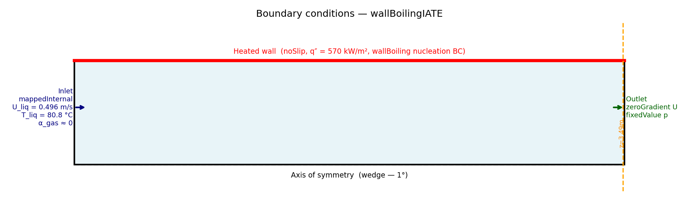
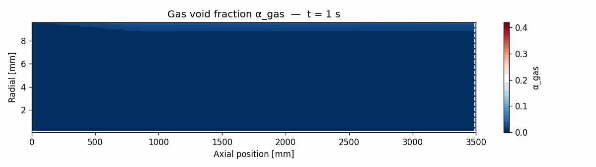
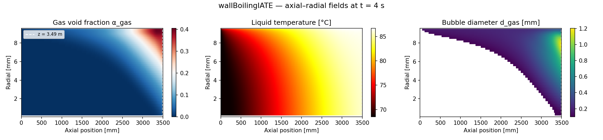
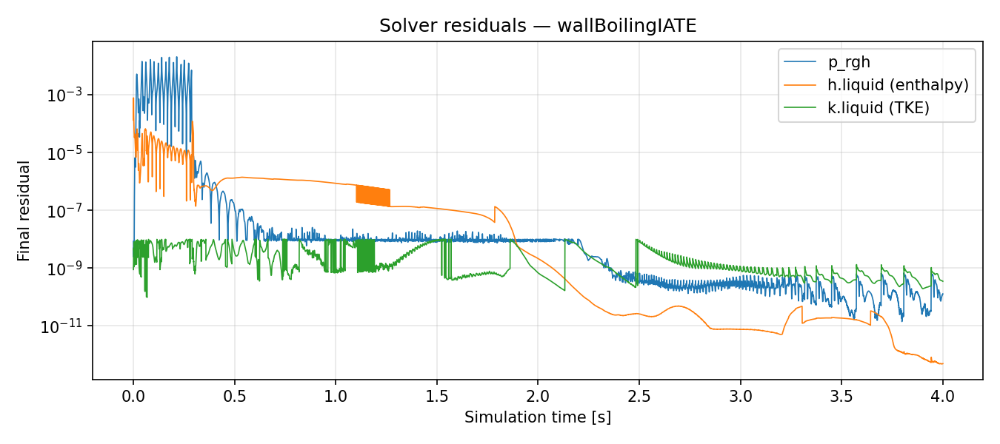
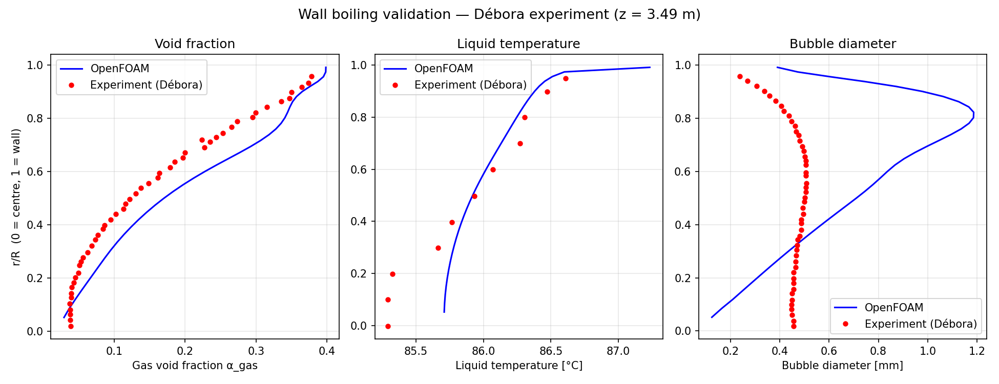
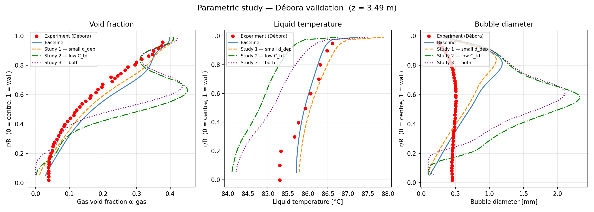

# wallBoilingIATE — OpenFOAM 13 Subcooled Flow Boiling with IATE

Simulation of subcooled nucleate boiling in a heated vertical pipe using the
`multiphaseEuler` solver. A sub-cooled liquid water stream flows upward through
a uniformly heated tube; nucleation at the wall generates steam bubbles that
partially condense back into the liquid as they migrate toward the cooler core.
The bubble size evolves dynamically via the **Interfacial Area Transport Equation
(IATE)**. Results are validated against the Débora experimental dataset and a
parametric study explores the sensitivity of key closure coefficients.

---

## Physical Setup

| Parameter | Value |
|---|---|
| Pipe radius R | 9.6 mm |
| Pipe length L | 3.5 m |
| Liquid velocity (bulk) | 1.752 m/s (upward) |
| Liquid inlet temperature | 80.8 °C |
| Wall heat flux q″ | 73,890 W/m² |
| Saturation temperature | ~90.5 °C (at operating pressure) |
| Sub-cooling at inlet | ~9.7 K |
| Geometry | Axisymmetric wedge (1°) |

The bulk liquid remains sub-cooled throughout the pipe; bubbles nucleate at the
heated wall, detach, and partially condense as they travel into the cooler core.
This **subcooled nucleate boiling** regime is characterised by a thin near-wall
vapour layer and a relatively small global void fraction.

---

## Mesh

| Parameter | Value |
|---|---|
| Cells | 350 × 40 = 14,000 |
| Cell type | Hexahedral (axisymmetric wedge, 1° sector) |
| Axial resolution | Uniform, Δx = 10 mm |
| Radial resolution | Graded (ratio 0.5) — cells refined toward wall |
| Inlet | Left face (x = 0) — mappedInternal |
| Outlet | Right face (x = 3.5 m) |
| Wall | Top face — heated, no-slip |
| Axis | Bottom face — wedge symmetry |

**Boundary conditions:**


---

## Physics Models

### Two-Fluid (Euler–Euler)

Both gas (steam) and liquid (water) are treated as interpenetrating continua.
The phase fraction constraint α_gas + α_liquid = 1 is enforced everywhere.

### IATE — Interfacial Area Transport Equation

Rather than prescribing a fixed bubble diameter, IATE transports the interfacial
area concentration κ_i (m⁻¹), from which the local Sauter mean diameter is
derived: d = 6α/κ_i. The source terms model three bubble interaction mechanisms:

| Mechanism | Model | Baseline coefficient | Effect on d |
|---|---|---|---|
| Wake entrainment coalescence | C_we | 0.002 | Increases d |
| Random coalescence | C_rc | 0.04 | Increases d |
| Turbulent break-up | C_ti, We_cr | 0.085, 6 | Decreases d |

### Wall Boiling Model

The heated wall applies a **wallBoiling** boundary condition for void fraction.
It partitions the wall heat flux q″ into three components following the
Kurul–Podowski model:

- **Single-phase convection** — heat transferred directly to the liquid
- **Quenching** — transient conduction during bubble departure/rewetting
- **Evaporation** — latent heat carried away by departing bubbles

Sub-models used:

| Quantity | Model |
|---|---|
| Nucleation site density N | Lemmert–Chawla |
| Bubble departure diameter d_d | Tolubinski–Kostanchuk (d_ref = 0.24 mm) |
| Bubble departure frequency f | KocamustafaogullariIshii |

### Interphase Transfer

| Mechanism | Model |
|---|---|
| Drag | IshiiZuber |
| Lift | Tomiyama (wall-damped, C_l = 0.288) |
| Virtual mass | Constant C_vm = 0.5 |
| Turbulent dispersion | LopezDeBertodano (C_td = 1.0) |
| Interfacial condensation | Heat transfer limited phase change |

### Turbulence

| Phase | Model |
|---|---|
| Liquid | k-ω SST |
| Gas | Zero equation |

---

## Solver Setup

| Setting | Value |
|---|---|
| Solver | `multiphaseEuler` |
| Time discretisation | Euler implicit |
| Pressure–velocity coupling | PIMPLE |
| End time | 4 s |
| Initial time step | 0.1 ms |
| Write interval | 0.5 s |

---

## Results

### Void Fraction Evolution

**Gas void fraction α_gas building up along the heated wall (t = 1 – 4 s):**


The near-wall vapour layer grows axially from the inlet as the liquid absorbs
heat and nucleation intensifies. By t ≈ 2 s the distribution is stationary.

### Axial–Radial Field Distributions

**Gas void fraction, liquid temperature, and bubble diameter at t = 4 s:**


Key features:
- **Void fraction**: Peaks near the heated wall (α ≈ 0.40) and decays sharply
  toward the pipe centre. The void fraction grows axially as more bubbles
  accumulate along the heated length.
- **Liquid temperature**: Highest at the wall and cooler at the core, consistent
  with the sub-cooled inlet and the wall heat flux. The temperature gradient
  drives condensation of bubbles that migrate inward.
- **Bubble diameter**: Increases toward the wall and downstream as coalescence
  outpaces break-up in the near-wall region.

### Convergence

**Solver residuals for p_rgh, h.liquid (enthalpy), and k.liquid (TKE):**


All residuals fall by several orders of magnitude within the first 0.5 s as the
boiling boundary layer establishes. After ~1 s the solution is stationary; the
remaining oscillations in p_rgh are the PIMPLE pressure-correction cycle noise
rather than physical unsteadiness.

---

## Validation — Débora Experiment

The simulation is validated against the **Débora** experimental dataset (Garnier
et al., 2001), which measured radial profiles of void fraction, liquid
temperature, and bubble diameter in a heated vertical tube under conditions
closely matching this case.

**Radial profiles at z = 3.49 m (measurement plane):**


### Why void fraction and temperature agree but bubble diameter does not

The void fraction and liquid temperature profiles are governed primarily by the
**enthalpy equation** and the **bulk heat balance** — the wall heat flux drives
liquid superheat at the wall, nucleation generates steam, and the subcooled core
condenses it back. These processes are well-captured by the two-fluid energy
equations and the Kurul–Podowski wall boiling partition, independent of the
exact bubble size.

The bubble diameter, by contrast, is entirely determined by the **IATE transport
equation**, which evolves the interfacial area concentration κ_i from which
d = 6α/κ_i is derived. The baseline over-predicts d by a factor of ~2–3 (1.2 mm
vs ~0.5 mm measured near the wall). The root cause is that **coalescence
dominates over break-up** along the 3.5 m pipe length — bubbles nucleate at
~0.24 mm at the wall but grow continuously via random and wake-entrainment
coalescence before they can be split by turbulence.

There are two structural reasons why the IATE closures struggle here:

1. **The IATE models were calibrated for adiabatic bubbly pipe flow** at moderate
   to high void fractions (α > 0.1 globally). In subcooled boiling the void is
   concentrated in a thin near-wall layer with α locally up to 0.4 but globally
   much lower. The random coalescence model (C_rc = 0.04) assumes a homogeneous
   bubble population that collides throughout the cross-section; in reality the
   near-wall bubbles are geometrically constrained and collide far less freely
   than in an adiabatic flow.

2. **Turbulent break-up is effectively inactive at these conditions.** The
   break-up term requires local turbulent eddies with Weber number We > We_cr = 6
   to split a bubble. In the near-wall region of this low-void subcooled flow the
   turbulent kinetic energy is not sufficient to routinely exceed this threshold,
   so break-up cannot counteract coalescence regardless of the We_cr value chosen.

The parametric study below demonstrates both points quantitatively.

---

## Parametric Study

Six model variants were run to isolate the sensitivity of each closure. All
parametric runs use t = 2.5 s (solution is stationary by ~2 s). Case input files
and extracted radial profiles are stored in `studies/`.

| Study | Change from baseline | Key parameters |
|---|---|---|
| Baseline | — | d_ref = 0.24 mm, C_td = 1.0, C_rc = 0.04, We_cr = 6 |
| Study 1 | Smaller departure diameter | d_ref = 0.15 mm, d_max = 0.6 mm |
| Study 2 | Reduced turbulent dispersion | C_td = 0.3 |
| Study 3 | Study 1 + Study 2 | d_ref = 0.15 mm, C_td = 0.3 |
| Study 4 | Reduced random coalescence | C_rc = 0.01 |
| Study 5 | Lower break-up threshold | We_cr = 3 |
| Study 6 | Study 4 + Study 5 | C_rc = 0.01, We_cr = 3 |

**All studies vs Débora experiment:**


### Findings

**Void fraction** — Studies 2 and 3 (reduced C_td) give the largest improvement,
pulling the mid-radius over-prediction in line with the data. Turbulent
dispersion was spreading bubbles too far toward the pipe centre; halving C_td
tightens the void peak near the wall where it belongs. Studies 4–6 (IATE
coalescence/break-up changes) have minimal effect on void fraction, confirming
that the void distribution is governed by momentum transport, not bubble size.

**Liquid temperature** — All studies remain close to each other and to the
experiment. The temperature profile is insensitive to bubble size or dispersion
tuning because it is set by the bulk heat balance between wall flux and
convective transport, which none of the parametric changes alter.

**Bubble diameter** — Study 1 (smaller d_ref) reduces the near-wall diameter
from 1.2 mm to ~0.8 mm by seeding smaller bubbles at the wall. Study 4 (lower
C_rc) reduces it further to ~0.9 mm by slowing coalescence along the pipe.
Study 5 (lower We_cr) has almost no effect, confirming that turbulent break-up
is inactive at these conditions — the turbulent kinetic energy near the wall is
insufficient to split bubbles regardless of the threshold. Study 6 (C_rc + We_cr)
tracks Study 4, again showing We_cr is inert. Even with all coalescence and
departure-diameter changes applied, the diameter remains over-predicted by
roughly 0.3–0.4 mm. Closing this gap would require either a subcooled-boiling-
specific coalescence model that accounts for the geometrically constrained
near-wall bubble population, or a wall condensation sink term in the IATE
equation to shrink bubbles that re-enter the subcooled core.

---

## References

Garnier, J., Manon, E., & Cubizolles, G. (2001). Local measurements on flow
boiling of refrigerant 12 in a vertical tube. *Multiphase Science and
Technology*, 13(1–2), 1–111.

Kurul, N., & Podowski, M. Z. (1990). On the modelling of multidimensional
effects in boiling channels. *Proceedings of the 27th National Heat Transfer
Conference*, Minneapolis.

Lemmert, M., & Chawla, J. M. (1977). Influence of flow velocity on surface
boiling heat transfer coefficient. *Heat Transfer in Boiling*, Academic Press.

Tolubinski, V. I., & Kostanchuk, D. M. (1970). Vapour bubbles growth rate and
heat transfer intensity at subcooled water boiling. *4th International Heat
Transfer Conference*, Paris.

---

## Running the Case

```bash
source /opt/openfoam13/etc/bashrc
cd openfoam-wallBoilingIATE
blockMesh
extrudeMesh
decomposePar
mpirun -np 4 foamRun -parallel
reconstructPar
foamPostProcess -latestTime -func "graphCell(name=graph, start=(3.4901 0 0), end=(3.4901 0.0096 0), fields=(alpha.gas T.liquid T.gas d.gas))"
python3 post_process.py          # field contours, mesh, convergence, validation plots
python3 plot_study_comparison.py # parametric study comparison
```
