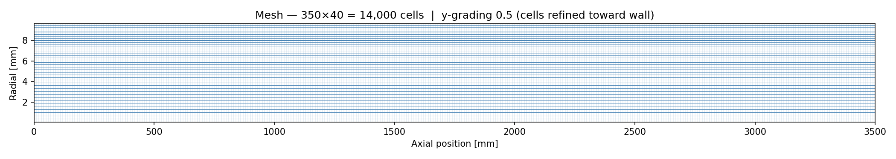

# wallBoilingIATE — OpenFOAM 13 Subcooled Flow Boiling with IATE

Simulation of subcooled nucleate boiling in a heated vertical pipe using the
`multiphaseEuler` solver. A sub-cooled liquid water stream flows upward through
a uniformly heated tube; nucleation at the wall generates steam bubbles that
partially condense back into the liquid as they migrate toward the cooler core.
The bubble size evolves dynamically via the **Interfacial Area Transport Equation
(IATE)**. Results are validated against the Débora experimental dataset.

---

## Physical Setup

| Parameter | Value |
|---|---|
| Pipe radius R | 9.6 mm |
| Pipe length L | 3.5 m |
| Liquid velocity (bulk) | 1.752 m/s (upward) |
| Liquid inlet temperature | 80.8 °C |
| Wall heat flux q″ | 73,890 W/m² |
| Saturation temperature | ~90.5 °C (at operating pressure) |
| Sub-cooling at inlet | ~9.7 K |
| Geometry | Axisymmetric wedge (1°) |

The bulk liquid remains sub-cooled throughout the pipe; bubbles nucleate at the
heated wall, detach, and partially condense as they travel into the cooler core.
This **subcooled nucleate boiling** regime is characterised by a thin near-wall
vapour layer and a relatively small global void fraction.

---

## Mesh

| Parameter | Value |
|---|---|
| Cells | 350 × 40 = 14,000 |
| Cell type | Hexahedral (axisymmetric wedge, 1° sector) |
| Axial resolution | Uniform, Δx = 10 mm |
| Radial resolution | Graded (ratio 0.5) — cells refined toward wall |
| Inlet | Left face (x = 0) — mappedInternal |
| Outlet | Right face (x = 3.5 m) |
| Wall | Top face — heated, no-slip |
| Axis | Bottom face — wedge symmetry |

**Mesh (350 axial × 40 radial, y-grading 0.5 toward wall):**


**Boundary conditions:**


---

## Physics Models

### Two-Fluid (Euler–Euler)

Both gas (steam) and liquid (water) are treated as interpenetrating continua.
The phase fraction constraint α_gas + α_liquid = 1 is enforced everywhere.

### IATE — Interfacial Area Transport Equation

Rather than prescribing a fixed bubble diameter, IATE transports the interfacial
area concentration κ_i (m⁻¹), from which the local Sauter mean diameter is
derived: d = 6α/κ_i. The source terms model three bubble interaction mechanisms:

| Mechanism | Model | Effect |
|---|---|---|
| Wake entrainment coalescence | C_we = 0.002 | Bubbles drafted together behind rising bubbles coalesce |
| Random coalescence | C_rc = 0.04, C = 3 | Random collisions between bubbles lead to coalescence |
| Turbulent break-up | C_ti = 0.085, We_cr = 6 | Turbulent eddies with sufficient energy split bubbles |

### Wall Boiling Model

The heated wall applies a **wallBoiling** boundary condition for void fraction.
It partitions the wall heat flux q″ into three components following the
Kurul–Podowski model:

- **Single-phase convection** — heat transferred directly to the liquid
- **Quenching** — transient conduction during bubble departure/rewetting
- **Evaporation** — latent heat carried away by departing bubbles

Sub-models used:

| Quantity | Model |
|---|---|
| Nucleation site density N | Lemmert–Chawla |
| Bubble departure diameter d_d | Tolubinski–Kostanchuk |
| Bubble departure frequency f | Cole |
| Nucleate boiling suppression | Experimental correlation |

### Interphase Transfer

| Mechanism | Model |
|---|---|
| Drag | Schiller–Naumann |
| Lift | Tomiyama |
| Virtual mass | Constant C_vm = 0.5 |
| Turbulent dispersion | Burns et al. |
| Interfacial condensation | ranzMarshall heat transfer |

### Turbulence

| Phase | Model |
|---|---|
| Liquid | k-ω SST |
| Gas | Zero equation |

---

## Solver Setup

| Setting | Value |
|---|---|
| Solver | `multiphaseEuler` |
| Time discretisation | Euler implicit |
| Pressure–velocity coupling | PIMPLE |
| End time | 4 s |
| Initial time step | 0.1 ms |
| Write interval | 0.5 s |

---

## Results

### Axial–Radial Field Distributions

**Gas void fraction, liquid temperature, and bubble diameter at t = 4 s:**


Key features:
- **Void fraction**: Peaks near the heated wall (α ≈ 0.40) and decays sharply
  toward the pipe centre. The void fraction grows axially as more bubbles
  accumulate along the heated length.
- **Liquid temperature**: Highest at the wall and cooler at the core, consistent
  with the sub-cooled inlet and the wall heat flux. The temperature gradient
  drives condensation of bubbles that migrate inward.
- **Bubble diameter**: Increases toward the wall and downstream as coalescence
  outpaces break-up in the near-wall region.

### Convergence

**Solver residuals for p_rgh, h.liquid (enthalpy), and k.liquid (TKE):**


All residuals fall by several orders of magnitude within the first 0.5 s as the
boiling boundary layer establishes. After ~1 s the solution is stationary; the
remaining oscillations in p_rgh are the PIMPLE pressure-correction cycle noise
rather than physical unsteadiness.

---

## Validation — Débora Experiment

The simulation is validated against the **Débora** experimental dataset (Garnier
et al., 2001), which measured radial profiles of void fraction, liquid
temperature, and bubble diameter in a heated vertical tube under conditions
closely matching this case.

**Radial profiles at z = 3.49 m (measurement plane):**


### Discussion

| Quantity | Agreement | Notes |
|---|---|---|
| Void fraction | Good | Correct near-wall peak and radial shape; slight over-prediction at r/R ≈ 0.5 |
| Liquid temperature | Good | Profile shape and near-wall gradient match well |
| Bubble diameter | Fair | Simulation over-predicts d near the wall (up to 1.2 mm vs ~0.5 mm measured) |

The bubble diameter over-prediction is a known limitation of the IATE model
with standard coalescence/break-up closures at these conditions. The
Lemmert–Chawla nucleation site density and Tolubinski departure diameter
correlations were calibrated for lower heat flux conditions and tend to produce
larger departure diameters here. Despite this, the void fraction and temperature
profiles remain physically correct because the bulk heat balance is governed by
the enthalpy equation rather than the bubble size model directly.

---

## References

Garnier, J., Manon, E., & Cubizolles, G. (2001). Local measurements on flow
boiling of refrigerant 12 in a vertical tube. *Multiphase Science and
Technology*, 13(1–2), 1–111.

Kurul, N., & Podowski, M. Z. (1990). On the modelling of multidimensional
effects in boiling channels. *Proceedings of the 27th National Heat Transfer
Conference*, Minneapolis.

Lemmert, M., & Chawla, J. M. (1977). Influence of flow velocity on surface
boiling heat transfer coefficient. *Heat Transfer in Boiling*, Academic Press.

Tolubinski, V. I., & Kostanchuk, D. M. (1970). Vapour bubbles growth rate and
heat transfer intensity at subcooled water boiling. *4th International Heat
Transfer Conference*, Paris.

---

## Running the Case

```bash
source /opt/openfoam13/etc/bashrc
cd openfoam-wallBoilingIATE
blockMesh
extrudeMesh
decomposePar
mpirun -np 4 foamRun -parallel
reconstructPar
foamPostProcess -latestTime -func "graphCell(name=graph, start=(3.4901 0 0), end=(3.4901 0.0096 0), fields=(alpha.gas T.liquid T.gas d.gas))"
python3 post_process.py
```
